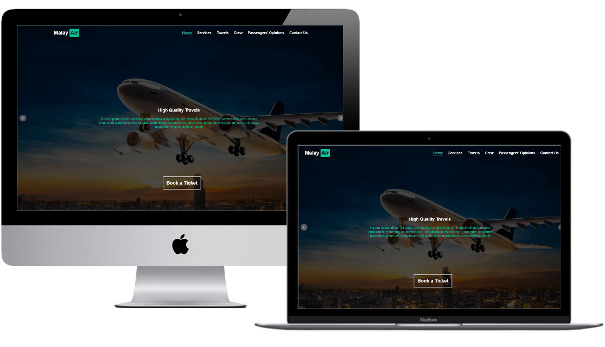

# Malay Air

  

Malay Air is a landing page website for a foreign airline.

(Not Responsive)  

  

## Demo
 

## Getting Started

You can try the Template from [here](https://malayair.netlify.app/)

## Prerequisites

Just Modern Browser like "Chrome" and a Code Editor for Deployment and Develop.

## Built With

* HTML5
* CSS3
* JS  

## Libraries  

* jQuery.js
* html5shiv.js
* Font Awesome  
* Normalize.css
  
## Plugins 

* BxSlider.js
* mixitup.js
* nicescroll.js  

## Author

* Mohamed Elhawary  

## Contact Me  

* Email: mohamed.k.elhawary@gmail.com

## Deploy with Me

Feel Free to Deploy it with me, send Issues or a Pull Request and i'll deal with you, just test it First.

## License

Licensed under the [MIT License](LICENSE)

